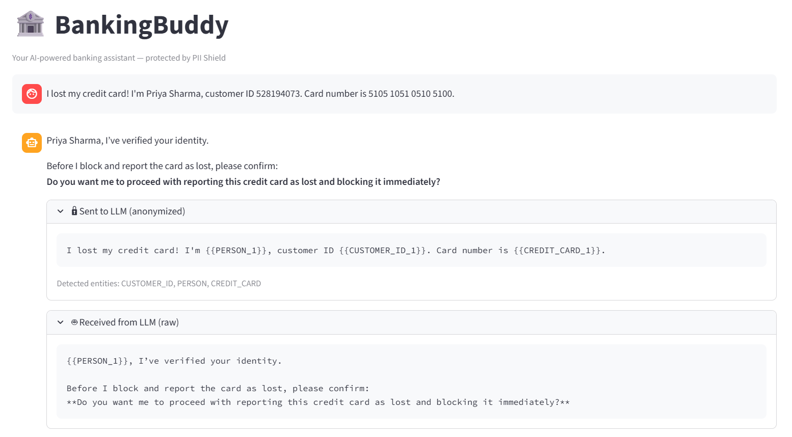

# BankingBuddy — Contoso Bank AI Assistant

A demo AI-powered banking assistant that uses **PII Shield** to protect
customer data from reaching the LLM. Built with Microsoft Agent Framework,
Azure OpenAI (GPT-5.1), and Streamlit.

## What It Does

BankingBuddy helps Contoso Bank customers:
- 🔓 **Unblock cards** — reactivate a blocked debit or credit card
- 🆕 **Order new cards** — request a replacement card
- 🚨 **Report lost cards** — mark a card as lost and auto-block it

All customer PII (names, Aadhaar, PAN, emails, phone numbers) is
**anonymized before reaching the LLM** and **restored in the response**
using PII Shield's ChatMiddleware — the LLM never sees real customer data.




The screenshot above shows the PII Shield middleware in action. A customer ("Priya Sharma") sends a message containing her name, customer ID, and credit card number. The expandable **"Sent to LLM (anonymized)"** panel reveals what GPT-5.1 actually sees — every PII value is replaced with a deterministic placeholder (`{{PERSON_1}}`, `{{CUSTOMER_ID_1}}`, `{{CREDIT_CARD_1}}`). The model reasons over those placeholders and the **"Received from LLM (raw)"** panel shows its placeholder-preserving response. Before the user sees it, the middleware deanonymizes the placeholders back to the original values, producing a natural reply that addresses Priya by name. **Zero PII ever leaves your application boundary.**

## Architecture

```
User → Streamlit Chat UI → Agent Framework
                               │
                    PiiShieldChatMiddleware
                    ┌──────────┴──────────┐
                    │ ANONYMIZE           │ DEANONYMIZE
                    │ user messages       │ LLM responses
                    └──────────┬──────────┘
                               │
                        Azure OpenAI (GPT-5.1)
                        (sees only placeholders)
```

## Quick Start

### Prerequisites
- Python 3.10+
- Azure CLI (`az login`)
- Azure OpenAI deployment with GPT-5.1

### Local Setup

```bash
# 1. Clone and enter the project
cd pii-agent-demos

# 2. Create virtual environment
python -m venv .venv
source .venv/bin/activate

# 3. Install dependencies
pip install -r requirements.txt

# 4. Configure environment
cp .env.example .env
# Edit .env with your Azure OpenAI endpoint and model deployment

# 5. Run the Streamlit chat UI
streamlit run app/streamlit_chat.py
```

### Docker

```bash
docker compose up
```

## Project Structure

```
bankingbuddy/          # Core agent package
  agent.py           # Agent definition (tools, middleware, instructions)
  middleware.py       # PiiShieldChatMiddleware
  tools.py           # Banking tool functions
  fake_data.py       # In-memory customer/card database

app/
  streamlit_chat.py  # Streamlit chat UI

infra/               # Azure deployment (Terraform + scripts)
tests/               # Unit tests
```

## Azure Deployment

See [DEPLOYMENT.md](DEPLOYMENT.md) for full Azure Container Apps deployment guide.

## License

MIT
